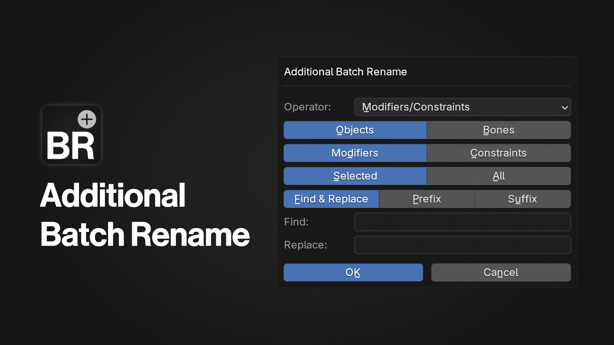

#  Additional Batch Rename

A Blender add-on that adds additional batch rename operators

# Features

The add-on allows you to easily batch rename:

- **Modifiers/Constraints**
- **Vertex Groups**

## Functions

This add-on has 10 settings:

- **Operator:** Switch between different batch renaming operators
- **Objects:** Set renaming target to objects only.
- **Bones:** Set renaming target to bones only.
- **Modifiers:** Rename modifiers names.
- **Constraints:** Rename constraint names. When the target is set to bones, it will automatically switch to constraints, as armatures don't contain modifiers.
- **Selected:** Rename only the selected objects.
- **All:** Rename all objects in the scene. When the target is set to bones only, rename all bones on the active armature.
- **Find & Replace:** Find the target name and replace it.
- **Exact Match:** If enabled, find only string with exact matches.
- **Prefix:** Add the new name at the beginning of the old name.
- **Suffix:** Add the new name at the end of the old name.
  
# How to Use

Right click on the viewport (in Object or Pose Mode) and you should find the **Additional Batch Rename** on the menu.
